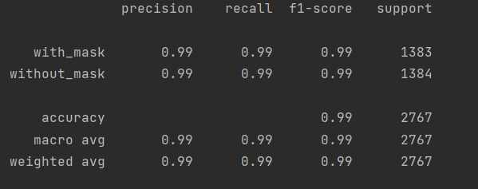

# Project: Face Mask Detection

Face Mask Detection system built with OpenCV, Keras/TensorFlow using Deep Learning and Computer Vision concepts in order to detect face masks in real-time video streams.

# ⌛ Project Demo


https://user-images.githubusercontent.com/66905080/130785625-57b5b892-274c-44b0-8d9d-e86cbb8bb6cc.mp4


## 👇 Install
###### This project requires Python and the following Python libraries installed:

* [NumPy](https://numpy.org/)
* [Pandas](https://pandas.pydata.org/)
* [OpenCV](https://opencv.org/)
* [scikit-learn](https://scikit-learn.org/stable/)
* [TensorFlow](https://www.tensorflow.org/install)

If you do not have Python installed yet, it is highly recommended that you install the python.
### OR 
All required libraries are included in the file ```requirements.txt```

# 📁 Dataset
The dataset used can be downloaded here - [Click to Download]()

This dataset consists of 13,833 images belonging to two classes:

* with_mask: 6915 images
* without_mask: 6918 images

The images used were real images of faces wearing masks. The images were collected from the [Kaggle datasets](https://www.kaggle.com/) sources.

# 🚀  Installation
Clone the repo
```
git clone https://github.com/Nitesh639/Face_Mask-_Detection.git
```
Change your directory to the cloned repo
```
cd Face_Mask-_Detection
```
Now, run the following command in your Terminal/Command Prompt to install the libraries required
```
pip3 install -r requirements.txt
```

# 💡 Working
To detect face masks in real-time video streams type the following command:
``` 
python3 detect_mask.py 
```
# 🔑 Results
Our model gave good accuracy for Face Mask Detection after training via tensorflow.




